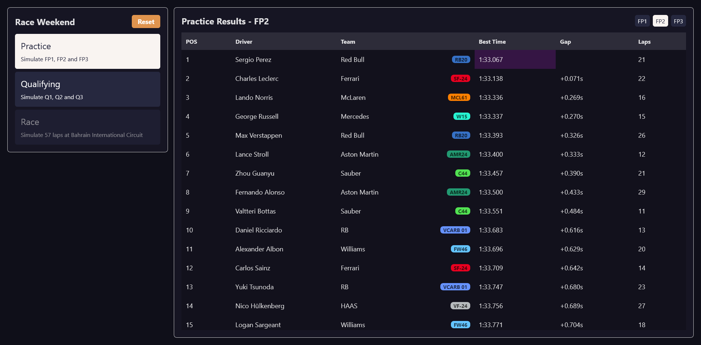
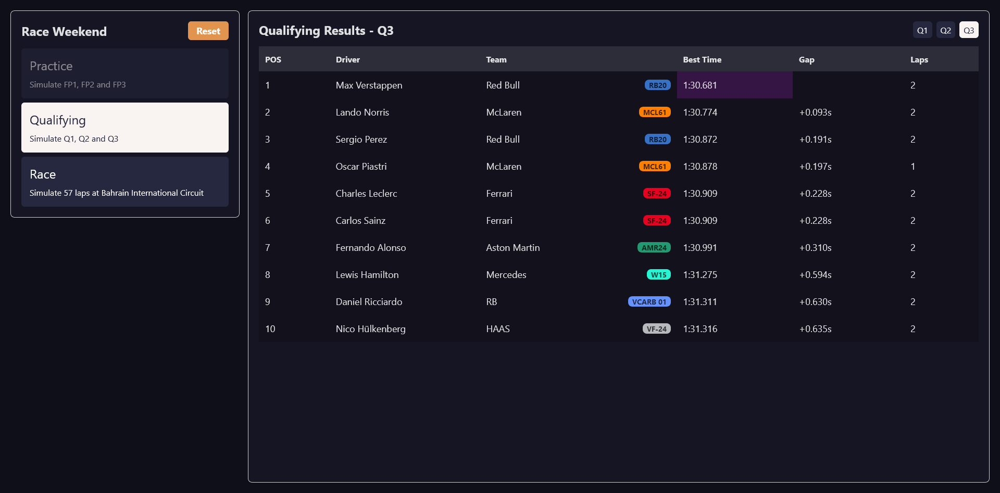
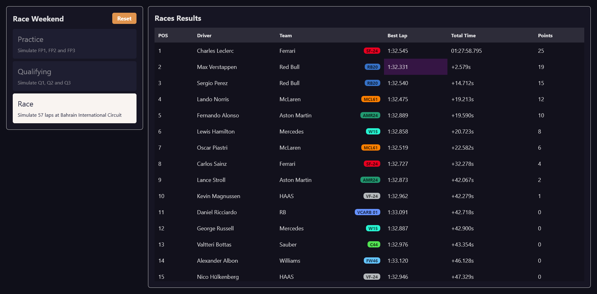

# F1 Sandbox Demo

This is a basic demo/proof of concept for a motorsport sandbox racing game. It focuses on simulating a Formula 1 race weekend including FP1, FP2, FP3, Q1, Q2, Q3 and a Race. It simulates driver and car performance fluctuations, driver mistakes, car mechanical issues, and DNFs. It also features a breakdown for every result in Practice, Qualifying and the Race showing the generated values and modifiers for each result.

This was put together in ~3 days to be a quick and simple visualization and is missing a lot of advanced features.

Live demo: <https://f1-sandbox-demo.slof.dev/>

## Screenshots

